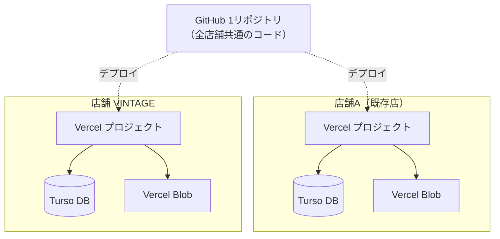

# ZC-CastMenu インフラ設計書

複数店舗での運用を前提とした、インフラ構成・データ分離・店舗追加の設計。
最終更新: 2026-06-17

## 設計の核心

**コード（GitHub 1リポジトリ）を全店舗で共有し、データ（DB・画像）を店舗ごとに分離する。**
コードに店名・キャスト等の固有データは持たせない。固有データはDB／Blobにあり、
Vercelプロジェクトの**環境変数で接続先を切り替える**ことで店舗を分ける。→ 店舗追加はコード変更ゼロ。

## 構成図

リクエスト時: Vercel が Turso からキャスト情報・店名・配色を取得し、画像は Blob の公開URLで配信。
画像アップロードは Vercel 経由で Blob へ保存（`@vercel/blob` の `put`）。

## データ分離

| 要素 | 単位 | 実体 |
|------|------|------|
| コード | 全店舗共有 | GitHub 1リポジトリ |
| アプリ / 公開URL | 店舗ごと | Vercel プロジェクト |
| DB（キャスト・店名・配色等） | 店舗ごと | Turso DB |
| 画像 | 店舗ごと | Vercel Blob ストア |

接続先を決める環境変数（**Vercelプロジェクト単位**で設定。この組み合わせが店舗を決める）:

| 変数 | 役割 |
|------|------|
| `TURSO_DATABASE_URL` / `TURSO_AUTH_TOKEN` | 接続先DBとその認証 |
| `BLOB_READ_WRITE_TOKEN` | 画像ストアの認証 |
| `NEXTAUTH_URL` | その店舗の公開URL |
| `NEXTAUTH_SECRET` | セッション暗号鍵（店舗ごとに別値） |

開発環境は `USE_LOCAL_DB=true` でローカルSQLite（`data/castmenu.db`）を使用、上記Turso/Blobは不要。
環境判定は `src/lib/db.ts`。

## 技術スタック

Next.js 14.2（App Router, TS厳密）/ Tailwind v3 / NextAuth v5 /
DB: Better-SQLite3（開発）・Turso（本番）/ 画像: Vercel Blob / ホスティング: Vercel（mainへのpushで自動デプロイ）。

## DB

スキーマ: `src/lib/database-schema.sql` ／ 初期化: `src/app/api/init-db/route.ts`（冪等）。

主要テーブル: `casts`（基本情報）, `cast_photos`（写真URL）, `cast_stats`（パラメータ）,
`badges`/`cast_badges`（バッジ）, `admins`, 店舗設定（店名・配色等）。

新規DBは空なので、作成後に `POST /api/init-db` を叩くとテーブル作成＋初期バッジ投入が走る。

## 店舗追加（例: VINTAGE）

新Vercelプロジェクト＋新Turso DB＋新Blob を1セット用意し、環境変数で結びつける。**GitHubは既存を共有**。

| 手順 | 内容 | ポイント |
|------|------|----------|
| ① Turso | 新DB作成（例 `vintage`）、URL・トークン取得 | 既存と別DBにすることで分離 |
| ② Blob | 新ストア作成、トークン取得 | 画像も店舗単位で分離 |
| ③ Vercel | 新プロジェクト作成 | **既存GitHubリポジトリを選択**（追加作成しない） |
| ④ 環境変数 | 上表の値を設定 | ①②と結びつけ＝店舗が確定 |
| ⑤ 初期化 | `POST /api/init-db` | テーブル・初期データ投入 |
| ⑥ 設定 | 管理画面で店名・配色・キャスト | コード変更不要 |

操作画面レベルの詳細は `docs/環境変数設定ガイド.md`。

## 店舗ドメイン戦略

「店舗ごとにどう URL を切るか」の方針整理。原則は **店舗 = 1 Vercel プロジェクト = 1 ドメイン** で固める。

### 3つのオプションと比較

| 観点 | A. 完全別ドメイン (shop-a.com, shop-v.com) | B. 共通親ドメインのサブドメイン (a.castmenu.app, vintage.castmenu.app) | C. パス分離 (castmenu.app/shop-a, /vintage) |
|------|--------|--------|--------|
| Vercel プロジェクト | 店舗ごとに別 | 店舗ごとに別 | 1プロジェクトで全店舗 |
| DB 分離 | 完全分離（環境変数） | 完全分離（環境変数） | リクエストから店舗判定が必要（マルチテナント DB or 切替ロジック） |
| 画像 Blob | 完全分離 | 完全分離 | リクエスト時に store を切替（複雑） |
| 認証セッション | 完全独立（Cookie ドメイン別） | 親ドメインを切れば独立。共有も可能 | Cookie が混ざる。店舗ごとに分けるならパス Cookie 制御が必要 |
| ドメイン管理コスト | 店舗数だけ独自ドメイン購入 | 親ドメイン1つを保有すれば店舗追加はサブドメイン追加だけ（ほぼ無料） | 親ドメイン1つで運用可能 |
| ブランドイメージ | 店舗ごとに独立感を出せる | 親ブランドが透ける（店舗側がそれを嫌がる場合は不向き） | 親ブランドが完全に透ける |
| 障害切り分け | 完全独立。1店舗が落ちても他に影響なし | 完全独立 | 全店舗が1プロジェクトに依存（同時影響あり） |
| 実装変更 | 不要（現状の構成のまま店舗追加可能） | 不要（同上） | 大幅変更：店舗識別 → DB/Blob 切替の中間層が必要 |

### 推奨: A または B（プロジェクト分離型）

C（パス分離・マルチテナント）はコードの大改修が必要で、現状の **「1プロジェクト＝1店舗」設計と相性が悪い**。
**店舗側が独自ドメインを希望するなら A**、**運用を一本化したいなら B** を選択する。

実体としては A/B どちらも「Vercel プロジェクト × Turso DB × Blob ストア」のセットを1組増やすだけで、
リポジトリのコード変更は不要。設計の核心（コード共有・データ分離）を維持できる。

### 既定の運用方針

- **新規店舗開店時**: まず `<店舗名>.zc-castmenu.app`（仮）のサブドメイン（B 方式）で立ち上げる
- **店舗側から独自ドメインの希望が出たら**: 同じプロジェクトに独自ドメインを追加マッピング（A への移行）。
  Vercel 上で複数ドメインを同一プロジェクトに割り当て可能なので、データ移行は不要。
  - サブドメインを残すかは要相談。残すと旧URLのブックマークが切れない利点あり。
- **Cookie / セッション**: 店舗ごとに `NEXTAUTH_URL` を個別に設定済みであり、セッション Cookie は
  プロジェクト = ドメイン単位で独立する。「店舗 A の管理画面 ログイン状態で店舗 B にもログインできてしまう」
  ということは構成上発生しない。

### 補足: 共通管理ポータルを作るかどうか

将来「複数店舗を横断して見たい」と要件が出た場合、横断ポータルはまた別の Vercel プロジェクトとして
独立に作るほうがクリーン（各店舗 DB に対する read-only クライアントを束ねる）。本体は店舗別分離を維持する。

## 既知の課題

- **インフラ所有者**: 全インフラ（GitHub・Vercel・Turso・Blob）が個人アカウント管理。
  事業継続性の観点から会社名義への再構築・移管を予定（別途整備）。
- **認証の店舗別化**: ~~管理者ログインが全店舗共通の固定値~~ → 2026-06 に DB 参照ベース（`admins` テーブル）へ移行済み。
  店舗が増えても各店舗の DB に独立した `admins` を持つため相互ログインは構造的に発生しない。
  ただし旧 `admin / password1234` のレガシーフォールバックは移行期の保険として残存しており、本番安定後に
  `DISABLE_LEGACY_LOGIN=1` で無効化する運用（手順は `docs/管理者運用ガイド.md` 参照）。

## 関連

`docs/環境変数設定ガイド.md`（操作手順）/ `docs/要件定義書.md`（機能要件）/ `CLAUDE.md`（概要）
